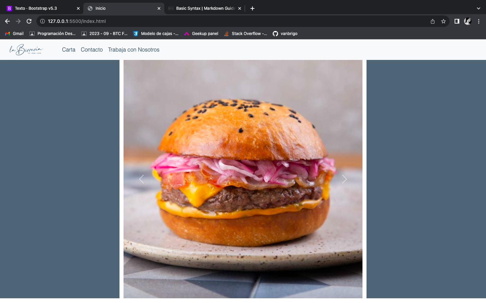
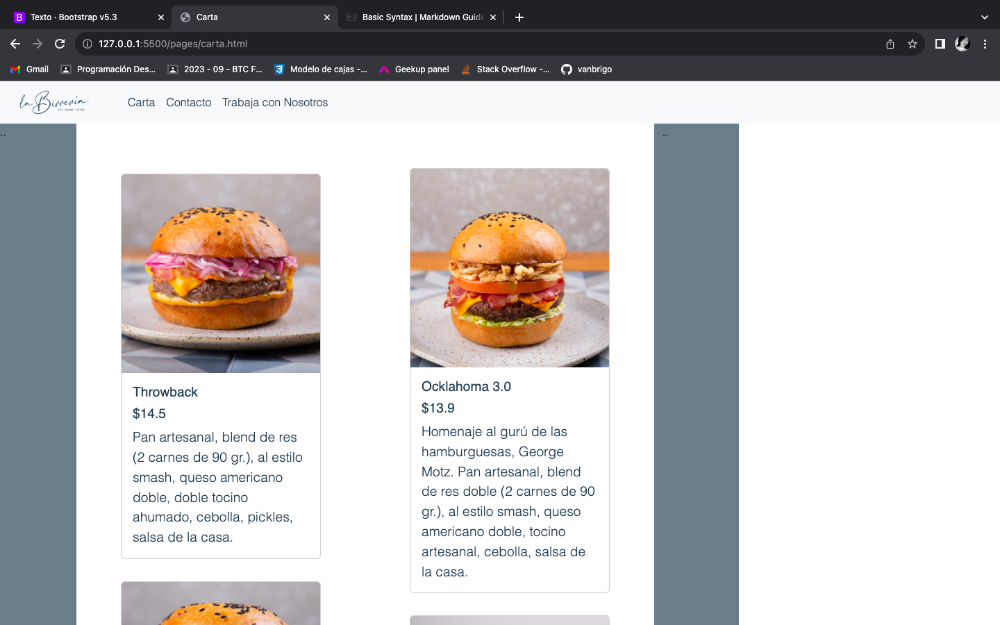
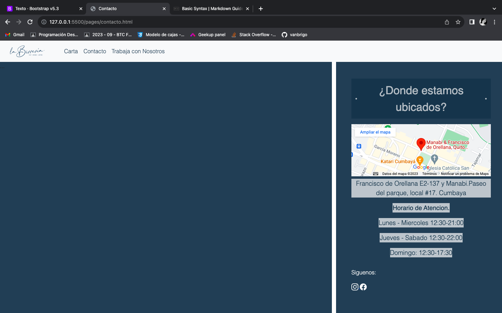

# Restaurante La Birreria

## Indice

- [Descripción](#descripción)
- [Capturas de Pantalla](#capturas-de-pantalla)
- [Tecnologías Utilizadas](#tecnologías-utilizadas)
- [Issues](#contribución)

## Descripción

Pagina web de un restaurante de hamburguesas. La web consta de 3 paginas: Pagina principal o de inicio, carta y contacto.
-Inicio: Esta es la pagina principal donde se muestran fotos de platos del restaurante.
-Carta: Muestra la oferta gastronomica del restaurante.
-Contacto: Informacion basica del restaurante como: Ubicacion, Horarios de atencion y redes sociales(Estas tienen enlaces para ir directo a las cuentas oficiales del restaurante).

## Capturas de Pantalla

(URL de la Pagina web[La Birreria](https://vanbrigo.github.io/fsd2023proyecto1/index.html))

## Tecnologías Utilizadas

- HTML5
- CSS3
- Boostrap

## Issues

La pagina no logra ser totalmente responsive. Se creo un boton para enlazar a pagina "Trabaja con nosotros" pero por falta de tiempo no se realizo dicha pagina.
